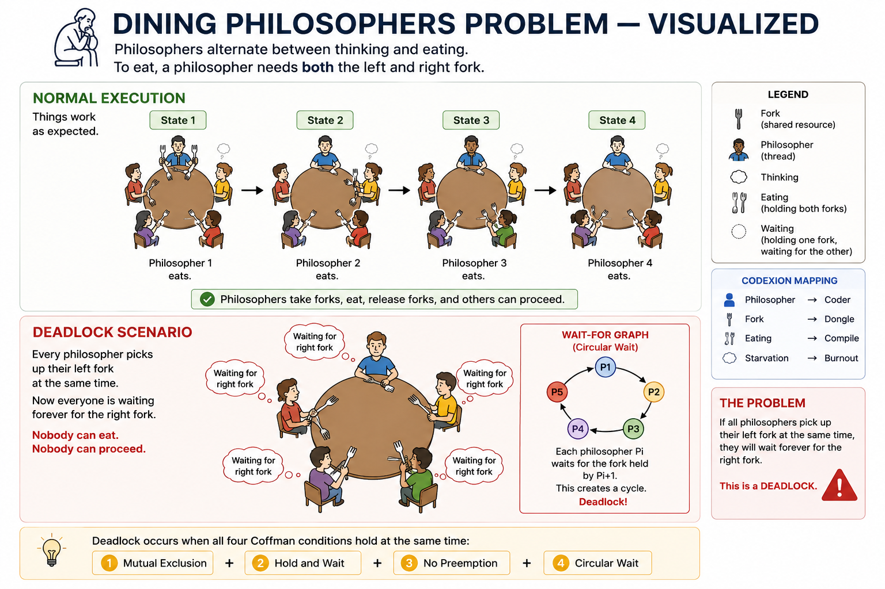

*This project has been created as part of the 42 curriculum by sarfreit.*

# Codexion

## 📋 Table of Contents

- [Description](#-description)
- [The problem behind Codexion](#-the-problem-behind-codexion)
- [Project structure](#️-project-structure)
- [`docs/` — extra study notes](#-docs--extra-study-notes)
- [Instructions](#️-instructions)
  - [Compilation](#compilation)
  - [Running](#running)
  - [make test](#make-test--an-extra-non-mandatory-convenience-target)
- [Resources](#-resources)
  - [How AI was used](#how-ai-was-used)
- [Blocking cases handled](#-blocking-cases-handled)
- [Thread synchronization mechanisms](#-thread-synchronization-mechanisms)
  - [How race conditions are prevented](#how-race-conditions-are-prevented)
  - [Thread-safe communication](#thread-safe-communication-between-coders-and-the-monitor)

## 📖 Description

Codexion is a multithreaded simulation written in C, modeled on the classic
**dining philosophers problem**. Instead of philosophers and forks, the
simulation has **coders** sitting around a circular co-working hub, competing
for a limited number of shared **USB dongles** to compile their code.

Each coder repeatedly cycles through three phases — **compile**, **debug**,
**refactor** — and needs to acquire *two* dongles (their left and right
neighbor's) simultaneously in order to compile. Dongles are protected by
mutexes, condition variables, and a cooldown period, and access is arbitrated
either **FIFO** (first come, first served) or **EDF** (Earliest Deadline
First — whoever is closest to burning out is served first), chosen at
runtime via the `scheduler` argument.

A separate **monitor thread** watches every coder and stops the simulation
the moment a coder **burns out** (fails to compile again within
`time_to_burnout` milliseconds) — or once every coder has compiled at least
`number_of_compiles_required` times.

The goal of the project is to implement this simulation without deadlocks,
without starving any coder under a feasible EDF configuration, with precise
(sub-10ms) burnout detection, and without any memory leaks or data races.

## 🍽️ The problem behind Codexion

Codexion is a variation of the classic **dining philosophers problem**
(Dijkstra, 1965) — coders instead of philosophers, dongles instead of
forks, compiling instead of eating.



A deadlock can only happen if all four of **Coffman's conditions** hold at
once. Codexion accepts the first three (they're inherent to the problem)
and specifically breaks the fourth — see "Blocking cases handled" below,
and [`docs/01-dining-philosophers.md`](./docs/01-dining-philosophers.md)
for a deeper walkthrough.

Broken down visually, with the specific example from this project:


## 🗂️ Project structure

```
codexion/
├── Makefile
├── README.md
├── docs/                      # extra study notes, written before/during
│   │                          # implementation — see below
│   └── ...
├── includes/
│   └── codexion.h             # all structs, the event enum, and function
│                              # prototypes shared across the project
└── src/
    ├── main.c                 # entry point: parses args, initializes the
    │                          # simulation, creates/joins all threads,
    │                          # cleans up
    │
    ├── parser.c               # validates the 8 command-line arguments
    │                          # (counts, ranges, overflow, scheduler value)
    │
    ├── init.c                 # allocates and initializes the simulation,
    │                          # its dongles, and its coders; symmetric
    │                          # cleanup on shutdown
    │
    ├── coder.c                # each coder thread's routine: the
    │                          # compile -> debug -> refactor loop
    │
    ├── dongle.c               # acquiring/releasing a single dongle and
    │                          # both dongles of a coder (cooldown,
    │                          # waiting queue, resource ordering)
    │
    ├── heap.c                 # a binary min-heap implemented from
    │                          # scratch, used as the waiting queue for
    │                          # each dongle
    │
    ├── scheduler_utils.c      # priority calculation (fifo/edf), the
    │                          # tie-breaker rule, and the comparison used
    │                          # by the heap
    │
    ├── monitor.c              # the monitor thread: detects burnout and
    │                          # the "everyone compiled enough" condition
    │
    ├── logs.c                 # formats and prints the required log
    │                          # lines, serialized with a mutex
    │
    └── utils.c                # small shared helpers (current time,
                               # safely reading the shared stop flag,
                               # swapping heap entries)
```

## 📚 `docs/` — extra study notes

The `docs/` folder contains a set of markdown files written while studying
the concepts behind this project (dining philosophers, pthreads,
FIFO/EDF scheduling, the heap, timing precision, and concurrency debugging
tools). They go into more depth than this README and are meant as a
reference for understanding *why* the implementation is built the way it
is — not as a substitute for reading the code itself.

Examples such as:


## ⚙️ Instructions

### Compilation

```bash
make
```

Compiles the project with `-Wall -Wextra -Werror -pthread`, producing the
`codexion` executable at the project root.

Other standard rules are also available:

```bash
make clean    # remove object files
make fclean   # remove object files and the executable
make re       # fclean + rebuild from scratch
```

### Running

```bash
./codexion number_of_coders time_to_burnout time_to_compile time_to_debug \
	time_to_refactor number_of_compiles_required dongle_cooldown scheduler
```

`scheduler` must be exactly `fifo` or `edf`. Example:

```bash
./codexion 5 800 200 200 200 3 100 fifo
```

```
0 1 has taken a dongle
0 1 has taken a dongle
0 1 is compiling
200 1 is debugging
...
```

### `make test` — an extra, non-mandatory convenience target

The Makefile also includes a `test` rule (not required by the subject) that
runs Norminette, Valgrind (leak-check), and Helgrind (race detection) in
one go, using a fixed set of arguments:

```bash
make test
```

To try different parameters, just edit the `ARGS_MULTI_STABLE` /
`ARGS_SINGLE_BURNOUT` variables at the top of the Makefile — no need to
change anything else, the target picks them up automatically.

## 📖 Resources

- [Multithreading in C](https://www.geeksforgeeks.org/c/multithreading-in-c/)
- [Threads, mutexes, and concurrent programming in C](https://www.codequoi.com/en/threads-mutexes-and-concurrent-programming-in-c/)
- [Heap Sort Algorithm](https://yuminlee2.medium.com/heap-sort-algorithm-6e200dc51845)
- [C Program to Implement Min Heap](https://www.geeksforgeeks.org/c/c-program-to-implement-min-heap/)
- [Insertion and Deletion in Heaps](https://www.geeksforgeeks.org/dsa/insertion-and-deletion-in-heaps/)
- [Condition, wait, signal in multithreading](https://www.geeksforgeeks.org/linux-unix/condition-wait-signal-multi-threading/)
- [Example using the C API usleep](https://www.ibm.com/support/pages/example-using-c-api-usleep)

### How AI was used

AI (Claude & ChatGPT) was used throughout this project as a **learning and review
tool**, not as a code generator to copy-paste from. Concretely, it was used
to:
- Explain concurrency concepts (Coffman's conditions, FIFO vs EDF scheduling,
  binary heaps, `pthread_cond_wait` vs `pthread_cond_timedwait`) before any
  code was written for those parts, through guided questions rather than
  ready-made answers — the notes produced this way make up the `docs/`
  folder.
- Review code I had already written, pointing out bugs (e.g., a deadlock in
  the single-coder edge case, a lost-wakeup bug after dongle cooldowns, data
  races on shared coder fields, Norm violations) without providing the fix
  directly — I then reasoned through and wrote each correction myself.

## 🔒 Blocking cases handled

- **Deadlock prevention (Coffman's conditions).** Mutual exclusion,
  hold-and-wait, and no-preemption are inherent to the problem (each dongle
  can only be held by one coder at a time, a coder holds one dongle while
  waiting for the second, and dongles are never forcibly taken away).
  **Circular wait** — the condition that actually causes deadlock — is
  broken with **resource ordering**: `take_both_dongles` always acquires
  the dongle with the *lower* `dongle_id` first. Since every coder follows
  the same global ordering, no cycle of coders can each be waiting on the
  next one's dongle.
- **Starvation prevention.** Each dongle keeps its own waiting queue as a
  min-heap, ordered by `priority_ms` (arrival time under `fifo`, burnout
  deadline under `edf`) plus a deterministic tie-breaker (`request_order`
  for `fifo`, `coder_id` for `edf`) for the rare case of an exact tie. A
  coder only proceeds once it is at the top of that heap, so under `edf`
  the most urgent coder is always served next, preventing it from starving
  as long as the given parameters are feasible.
- **Cooldown handling.** A dongle is only considered available once both
  `is_available` is true *and* `dongle_cooldown` milliseconds have elapsed
  since it was released. Waiting coders use `pthread_cond_timedwait` with a
  deadline computed from the cooldown window, so a coder that wakes up
  slightly too early goes back to sleep until the cooldown actually expires
  — without ever missing the moment it does, even if nobody signals it
  again in the meantime.
- **Precise burnout detection.** A dedicated monitor thread polls every
  coder's `last_compile_start_ms` every 2ms (well under the required 10ms
  window) and stops the simulation as soon as any coder exceeds
  `time_to_burnout`.
- **Log serialization.** All log output goes through a single
  `pthread_mutex_t` (`log_lock`), so two threads can never interleave their
  output on the same line.
- **Single-coder edge case.** With `number_of_coders == 1` there is only one
  dongle on the table, so a coder can never hold two simultaneously. The
  coder takes the single dongle and then waits indefinitely — it will
  always burn out, which matches the behaviour observed in another public
  Codexion implementation of this same subject.
- **Clean shutdown after burnout/completion.** A shared `should_stop` flag
  (protected by `stop_lock`) is checked at multiple points in a coder's
  cycle — before compiling, after compiling, and between the debug and
  refactor phases — so a coder stops as soon as it next has the chance,
  instead of completing an entire extra compile cycle after the simulation
  should have already ended.

## 🧵 Thread synchronization mechanisms

- **`pthread_mutex_t` per dongle (`dongle->lock`).** Protects a dongle's
  `is_available`, `released_at_ms`, and its waiting-queue heap. Any read or
  write to these fields happens strictly between a `lock`/`unlock` pair.
- **`pthread_cond_t` per dongle (`dongle->cond`).** A coder waiting for a
  dongle sleeps on this condition variable via `pthread_cond_timedwait`
  (not a plain `pthread_cond_wait`), since becoming available again is
  partly *time-driven* (the cooldown expiring) rather than purely
  event-driven. Releasing a dongle calls `pthread_cond_broadcast` (not
  `signal`), so that *every* coder waiting on it re-checks the condition —
  necessary since more than one coder may be waiting on the same dongle,
  and only the one at the top of its priority heap should actually proceed.
- **`pthread_mutex_t time_lock` per coder.** Protects `last_compile_start_ms`
  and `times_compiled`, which are written by the coder's own thread
  (`compile_phase`) and read concurrently by the monitor thread
  (`coder_is_in_burnout`, `coder_compilations_are_finished`) and by the
  scheduler (`calculate_priority`, under `edf`).
- **`pthread_mutex_t stop_lock`.** Protects the shared `should_stop` flag,
  written once by the monitor thread and read repeatedly by every coder
  thread and by `try_take_dongle` (so a coder blocked waiting for a dongle
  can also notice the simulation has ended and stop waiting).
- **`pthread_mutex_t request_lock`.** Protects `request_counter`, a single
  shared counter incremented every time any coder requests a dongle, used
  to produce each coder's `request_order` — the `fifo` tie-breaker.
- **`pthread_mutex_t log_lock`.** Protects the call to `printf` inside
  `print_log`, so two threads' log lines are never interleaved.

### How race conditions are prevented

Every field that is written by one thread and read by another is only ever
accessed while holding the mutex declared specifically for it (`time_lock`
for per-coder timing fields, `stop_lock` for `should_stop`, `request_lock`
for the request counter, each dongle's own `lock` for its state and waiting
queue). No shared field is ever read or written outside of its
corresponding lock — this was verified with **Helgrind**, which reports no
`Possible data race` anywhere in the project (only `Dubious: associated
lock is not held` warnings tied to `pthread_cond_timedwait`, a known
Helgrind/Valgrind limitation unrelated to actual data races — see
`docs/06-concurrency-debugging.md`).

### Thread-safe communication between coders and the monitor

The monitor thread never communicates with coder threads directly — it
only reads their shared, mutex-protected state (`last_compile_start_ms`,
`times_compiled`) and writes to the shared `should_stop` flag under
`stop_lock`. Coders, in turn, only ever read `should_stop` (never write to
it), always through the same lock. This one-way, lock-protected
communication avoids any need for the monitor and the coders to coordinate
more tightly than that.