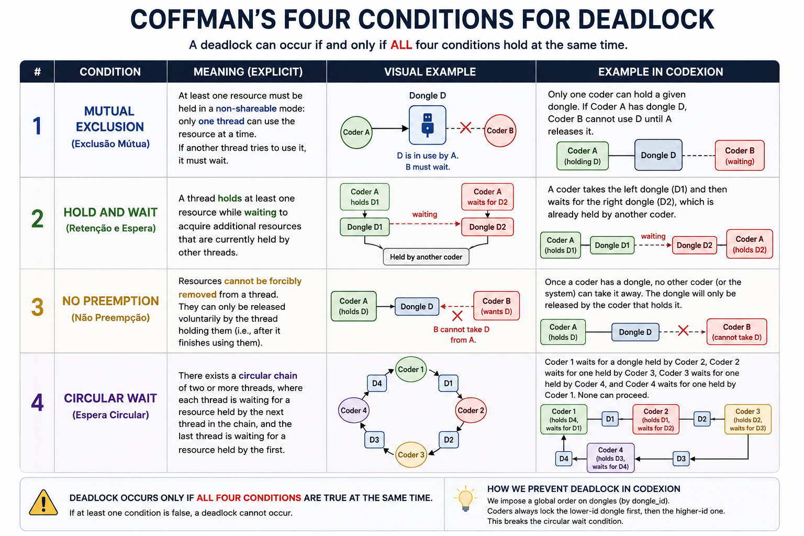

# 🍽️ Dining Philosophers & Deadlock Theory

## 📖 What it is

Proposed by **Edsger Dijkstra** in 1965, the dining philosophers problem is a classic
illustration of concurrency issues: **deadlock**, **starvation**, and **resource
contention**.

**Setup:**
- N philosophers sit around a circular table
- N forks are placed between them (one fork shared by each adjacent pair)
- Each philosopher alternates between **thinking** and **eating**
- Eating requires **both** neighboring forks (left and right)
- Philosophers never communicate with each other

**Codexion mapping:** coder → philosopher, dongle → fork, compile → eat, burnout → starve.

## ⚠️ The core problem

If every philosopher picks up their **left** fork at the same time, all of them will
be holding one fork and waiting forever for the second — nobody eats, nobody releases
anything. This is a **deadlock**.

## 🔒 Coffman's 4 conditions

A deadlock can only occur if **all four** of these hold simultaneously. Breaking
**any one** of them prevents deadlock entirely.

| # | Condition | Meaning | Example in Codexion |
|---|---|---|---|
| 1 | **Mutual exclusion** | A resource can only be held by one thread at a time | Only one coder can hold a given dongle |
| 2 | **Hold and wait** | A thread holds one resource while waiting for another | Coder holds left dongle, waits for right |
| 3 | **No preemption** | A resource can't be forcibly taken from a thread | Nobody can steal a dongle mid-compile |
| 4 | **Circular wait** | A cycle of threads each waiting on the next one's resource | Coder 1 waits on Coder 2's dongle, who waits on Coder 3's, ... back to Coder 1 |

## 🛠️ Classic ways to break the cycle

- **Resource ordering** — always acquire the lower-numbered dongle first (breaks circular wait)
- **Arbitrator / waiter** — a central authority grants permission to pick up both forks at once (breaks hold-and-wait)
- **Odd/even asymmetry** — odd-numbered philosophers pick up left-then-right, even-numbered pick up right-then-left
- **Timeout + backoff** — try to acquire, release and retry if the second resource isn't available (breaks hold-and-wait)

## 🧩 Deadlock vs Starvation vs Livelock

| Term | What happens | Analogy |
|---|---|---|
| **Deadlock** | Threads are stuck forever, no progress at all | Everyone frozen holding one fork |
| **Starvation** | Some threads make progress, but one specific thread never gets served | One philosopher always loses the race for a fork |
| **Livelock** | Threads keep changing state in response to each other, but no actual progress happens | Two people repeatedly stepping aside for each other in a hallway |

**Codexion's `burnout`** is essentially a **starvation** failure: the simulation doesn't
freeze, but one coder never gets to compile in time.

## 🧍 The N=1 edge case — read the subject twice here

The subject states the general rule ("N coders → N dongles, one dongle between
each pair") and then adds, almost as an aside: *"If there is only one coder,
there should be only one dongle on the table."* It's easy to read that sentence
as just clarifying the topology and move on — but sit with what it implies
before writing any code for this case.

**Compiling always needs *two* dongles at once** ("one in each hand"). With
exactly one dongle on the table, ask yourself: can a single coder ever satisfy
that requirement, no matter how the code is written? If the answer is no, what
should actually happen when you run the simulation with `number_of_coders=1`?
Does the coder loop forever without ever compiling? Does it eventually trigger
one of the two stop conditions the subject already defines? Which one, and why?

This is a case worth testing **before** you assume your general N-coder logic
"just handles it" — a two-dongle-at-once requirement colliding with a
one-dongle table is exactly the kind of edge case that's tempting to special-case
away (e.g., "let the single dongle count as both") without checking whether that
matches what the subject actually describes.

## 🔗 Why this matters for Codexion

The project explicitly requires:
- No deadlock (mutex + cond var protecting each dongle)
- No starvation under **either** scheduler (`fifo` guarantees order of arrival, `edf`
  guarantees the most urgent coder is served first)
- Liveness proof: "no coder should be starved of dongles and burn out under `edf`
  scheduling, provided parameters are feasible"

Understanding Coffman's conditions is what lets you *argue*, during defense, why your
implementation can't deadlock — not just observe that it didn't in your tests.

## 📚 Further reading
- Dijkstra, E. W. (1971) — original synchronization papers on cooperating processes
- Silberschatz, Galvin & Gagne, *Operating System Concepts* — chapter on deadlocks
