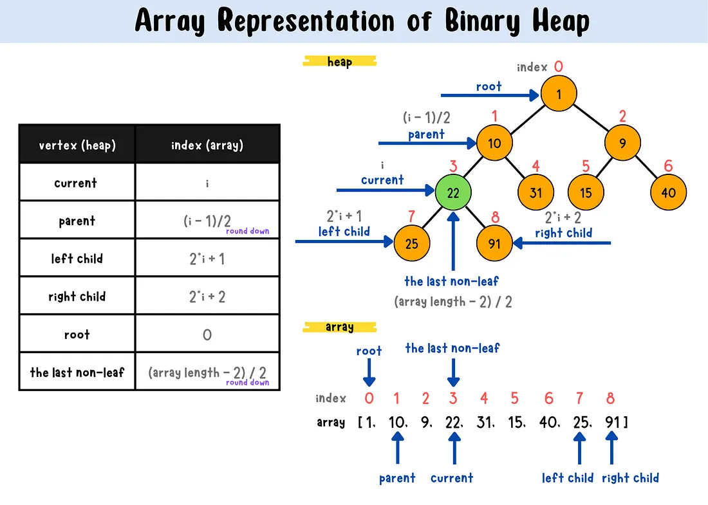

# 🌳 Binary Heap as a Priority Queue

## 📖 Why Codexion needs one

Both `fifo` and `edf` scheduling need to answer one question fast, repeatedly:
**"which waiting coder should get this dongle next?"**

A naive approach (loop through all waiters to find the minimum) works but is
`O(n)` per pick. A **binary heap** gives `O(log n)` insert and extract — and,
more importantly, the subject **forbids** using a standard library priority queue
(there isn't one in C anyway, but the point stands: you must build it yourself).



## 🌲 What a binary heap actually is

A **min-heap** is a binary tree with one property, and only one: **every parent
is smaller than (or equal to) both of its children.** That's it — that's the
entire rule. Nothing is said about how left and right children compare to each
other, or about any ordering *across* branches. This is what makes a heap
different from (and cheaper than) a fully sorted structure like a binary search
tree — a heap only guarantees the *top* is right, not that everything below is
in order.

```
            3
          /   \
         5     8
        / \   / \
       9   7 10  12
```

Every parent (3, 5, 8) is smaller than its children. Notice 5 and 8 aren't
compared to each other directly — that's fine, the heap property doesn't require
it. Only the path from any node up to the root matters.

### Why it's called "complete" and why that matters

A heap is a **complete** binary tree: every level is fully filled except
possibly the last, and the last level fills left-to-right with no gaps. This
one constraint is what allows the entire tree to live in a **flat array**,
with no pointers, no `left`/`right` fields, no wasted memory:

```
index:      0   1   2   3   4   5   6
value:      3   5   8   9   7  10  12
```

The tree drawn above and this array are the exact same structure. The
relationships are pure arithmetic:

```
parent(i) = (i - 1) / 2
left(i)   = 2*i + 1
right(i)  = 2*i + 2
```

Try it: `left(0) = 1` (value 5), `right(0) = 2` (value 8) — matches the tree.
`parent(3) = 1` (value 5) — node at index 3 (value 9) is a child of node at
index 1 (value 5) — matches the tree. This is why array-based heaps are so
common: you get a tree's logarithmic behavior with an array's simplicity and
cache-friendliness, no `malloc` per node needed.

### What "priority" means here — this is domain-specific, not built into the heap

The heap itself doesn't know or care what the numbers mean. For Codexion, you
choose what the priority key represents:
- **FIFO mode** → arrival timestamp (whoever asked first has the smallest
  timestamp, so they sit closest to the root)
- **EDF mode** → deadline (`last_compile_start + time_to_burnout` — whoever is
  closest to burning out has the smallest deadline, so *they* sit closest to
  the root instead)

The heap's mechanics (sift-up, sift-down) never change between these two modes
— only *what you compare* changes. This is worth sitting with: the data
structure is completely reusable, the comparison is the only domain-specific
piece.

## ⬆️⬇️ The two core operations, traced through an example

### Insert (`sift-up` / `bubble-up`)

**When it's used:** right after a new element is added at the very bottom
(end) of the array — it needs to travel up to its correct spot.

Start from this heap: `[3, 5, 8, 9, 7, 10, 12]`. Insert `4`.

1. **Place it at the end** of the array (the next open leaf position, keeping
   the tree complete): `[3, 5, 8, 9, 7, 10, 12, 4]` — index 7.
2. **Compare with its parent.** `parent(7) = (7-1)/2 = 3`, value `9`. Since
   `4 < 9`, they violate heap order — swap them:
   `[3, 5, 8, 4, 7, 10, 12, 9]`
3. **Repeat, now from index 3.** `parent(3) = 1`, value `5`. Since `4 < 5`,
   swap again: `[3, 4, 8, 5, 7, 10, 12, 9]`
4. **Repeat, now from index 1.** `parent(1) = 0`, value `3`. Since `4 > 3`,
   stop — heap property restored.

Notice the element only ever moves **up** a chain from leaf toward root,
comparing against ancestors — never sideways, never down. That single upward
path is why this is `O(log n)`: the height of a complete tree with `n` nodes
is `log n`, so the element crosses at most `log n` levels.

### Extract-min (`sift-down` / `bubble-down`)

**When it's used:** right after removing the root (the min) and moving the
last leaf into its place — that displaced element needs to sink down to
where it actually belongs.

Start from `[3, 4, 8, 5, 7, 10, 12, 9]`. Extract the minimum.

1. **The root (index 0) is always the answer** — that's the entire point of
   the heap property. Save it: `3`.
2. **Move the last element into the root's spot**, then shrink the array by
   one: take `9` (the last element) and put it at index 0:
   `[9, 4, 8, 5, 7, 10, 12]`
3. **Compare the new root against both children**, swap with whichever child
   is smaller (not just "a" child — if you swap with the wrong one, you can
   create a *new* violation on the other branch). `left(0)=4`, `right(0)=8` —
   smaller is `4`. Since `9 > 4`, swap: `[4, 9, 8, 5, 7, 10, 12]`
4. **Repeat from index 1.** `left(1)=3` (value `5`), `right(1)=4` (value `7`)
   — smaller is `5`. Since `9 > 5`, swap: `[4, 5, 8, 9, 7, 10, 12]`
5. **Repeat from index 3.** `left(3)=7` — out of bounds (array has 7 elements,
   indices 0-6). No children left — stop.

### The one detail that trips people up

In sift-down, you must compare against **both** children and pick the smaller
one to swap with — comparing against only the left child (or only whichever
you check first) can silently produce an invalid heap that still "looks"
mostly right in casual testing, but breaks under specific input orders. This
is the single most common heap bug — worth testing deliberately, not just
trusting that it works because it compiled.

## 🧩 Breaking this into functions (thinking through the 5-per-file limit)

The theory above describes **four** distinct pieces of behavior: inserting,
extracting, sifting up, and sifting down. That doesn't automatically mean four
functions — it means four *responsibilities* you need to account for
somewhere. How you group them is a real design decision, not something the
theory dictates. A few honest options, with their tradeoffs:

**Option A — one function per responsibility (4 functions):**
`heap_push`, `heap_pop`, `sift_up`, `sift_down` as fully separate functions,
with `heap_push` calling `sift_up` internally and `heap_pop` calling
`sift_down` internally. Cleanest separation, easiest to test each piece in
isolation, but costs you 4 of your 5-per-file budget before counting
initialization or anything else in the same file.

**Option B — fold the sift logic into push/pop (2 functions):**
`heap_push` contains its own sift-up loop inline, `heap_pop` contains its own
sift-down loop inline. Saves two functions, but each of `heap_push`/`heap_pop`
gets longer — worth checking against the 25-line-per-function limit once
written, since sift-down alone (comparing both children, tracking indices) is
not trivial.

**Option C — something in between:**
Keep `sift_down` separate (it's the more complex, more error-prone one — see
the "detail that trips people up" above), but fold `sift_up` (simpler, single
comparison per level) directly into `heap_push`. 3 functions instead of 4.

There's no universally "correct" choice here — it depends on how long each
function ends up once you actually write the comparisons and swaps, and how
many *other* heap-related functions (initialization, anything scheduler-
specific) need to live in the same file. Count what you actually have written
before deciding definitively; it's easier to notice you're at 23 lines and
need to split than to guess in advance.

### Don't forget initialization

Beyond push/pop/sift, something needs to set up the heap itself before any of
this runs — allocating (or sizing) the underlying array, setting `size` to
zero, setting `capacity`. Whether this is its own function or folded into
wherever your dongles/waiting-queues get set up is worth deciding explicitly,
since it's one more responsibility competing for the same 5-function budget.

## 🧮 The shape of the structure (not the solution)

A heap needs, at minimum: somewhere to store entries, how many slots are
currently used, and how many slots exist in total (so you know when you'd
need to grow, or whether you can pre-allocate once and never resize):

```c
typedef struct s_heap
{
    t_entry *data;
    int      size;
    int      capacity;
}   t_heap;
```

What goes inside `t_entry` is a design decision worth thinking through
yourself: do you store the priority value alongside a `coder_id` (lightweight,
but you then look the coder up elsewhere), or a direct pointer to the `t_coder`
(heavier coupling, but no extra lookup)? Either is defensible — the tradeoff is
"generic, reusable heap" vs. "heap that already knows about your domain."

## ⚠️ Things that are easy to get subtly wrong

- **Off-by-one on the "no children left" check.** A node has no left child
  when `left(i) >= size`; if it has a left child but `right(i) >= size`, it
  has only one child to compare against, not two.
- **Swapping with the wrong child in sift-down** (see above) — the most common
  bug, and the hardest to notice without a deliberate test.
- **Capacity vs. size.** `number_of_coders` bounds the maximum number of
  simultaneous waiters for any *one* dongle's queue — that bound is known
  upfront, which means you can decide whether a fixed-capacity array is enough
  or whether you actually need dynamic growth.
- **Comparator direction.** A min-heap and a max-heap differ by a single `<`
  vs `>` in the comparison — get it backwards and the heap "works" (no
  crashes) but silently serves the *lowest*-priority waiter first instead of
  the highest. This is a correctness bug, not a crash, so it won't show up
  unless you specifically check who gets served in what order.
- **Concurrent access.** Multiple coder threads may push to (or the releasing
  thread may pop from) the same dongle's waiting structure — this needs the
  same kind of protection you've already used elsewhere for shared state.

## 🔗 Why this matters for Codexion

- "You must implement a priority queue (heap) for FIFO/EDF scheduling (no
  standard library priority queue may be used)" is an explicit mandatory
  requirement — this isn't optional infrastructure, it's graded directly
- The heap is what backs **each dongle's waiting line** — every time a dongle
  is requested, the requester is pushed; every time it's released, the top of
  the heap is popped and woken up
- A wrong comparator (max-heap instead of min-heap, or a wrong deadline
  formula) breaks fairness **silently** — the program still runs, still
  compiles, still passes a casual test run. This is exactly the kind of bug
  that only shows up under stress testing with many coders and tight timings

## 📚 Further reading
- Cormen et al., *Introduction to Algorithms* — heap chapter (build-heap, heapify)
- Any visualization tool for heaps (e.g., VisuAlgo) to see sift-up/down in action